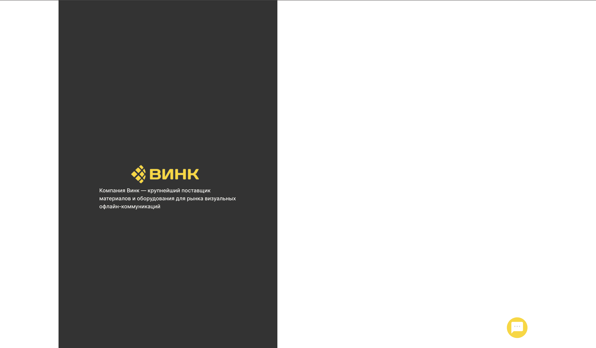

# Frontend для Чат бота приложения Vink

## Описание проекта

Проект по разработке и внедрению чат-бота с технологией GPT на сайт компании Винк для предоставления консультаций по материалам и оборудованию, а также оказания помощи клиентам 24/7.

## Используемые технологии

-  [TypeScript](https://www.typescriptlang.org/)
-  [React](https://ru.reactjs.org/)
-  [Socket.io](https://socket.io/)
-      [CSS](https://www.w3.org)

## Сведения о команде:

1. Сидорчук Николай - Профиль на GitHub [https://github.com/k0t1k777](https://github.com/k0t1k777) 
2. Козлов Иван - Профиль на GitHub [https://github.com/Karez79](https://github.com/Karez79)

## Макет:

[Сылка на макет в Figma](https://www.figma.com/file/77nFBA1Pwa1z36AfKEBdMC/%D0%A5%D0%B0%D0%BA%D0%B0%D1%82%D0%BE%D0%BD-%D0%92%D0%B8%D0%BD%D0%BA?type=design&node-id=0-1&mode=design&t=Kt8acsqnrpes1AxL-0)

## Ссылка на Github Pages:

Посмотреть сайт: [https://hackathon-vink-team-3.github.io/chat-bot-frontend/](https://hackathon-vink-team-3.github.io/chat-bot-frontend/)

## Инструкции по установке и запуску:

1. Клонируйте репозиторий: `git clone git@github.com:hackathon-Vink-Team-3/chat-bot-frontend.git`
2. Перейдите в директорию проекта: `cd chat-bot-frontend`
3. Установите зависимости: `npm install`
4. Запустите проект: `npm run dev`
5. В браузере открываем `http://localhost:5173/`

Или

1. Переходим по этой ссылке: `https://github.com/hackathon-Vink-Team-3/chat-bot-frontend.git`
2. Нажимаем `Code`
3. Нажимаем `Download ZIP`
4. Распаковываем скачанный архив в любое удобное место
5. Заходим в `Visual Studio Code`, в разделе `Файл` выбираем `Открыть папку`, выбираем распакованную папку, жмём `Ok`
6. В разделе `Терминал` выбираем `Создать терминал`
7. Пишем в терминале: `cd chat-bot-frontend`
8. Установка зависимости: `npm install`
9. Запуск проект: `npm run dev`
10. В браузере открываем `http://localhost:5173/`

## Ключевые точки для медиа min: 500px, max-width: 1440px

